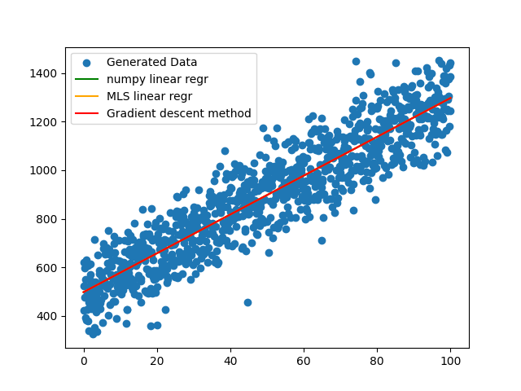
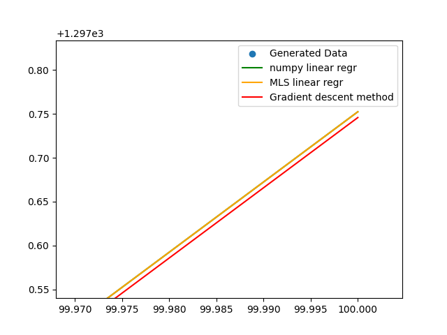
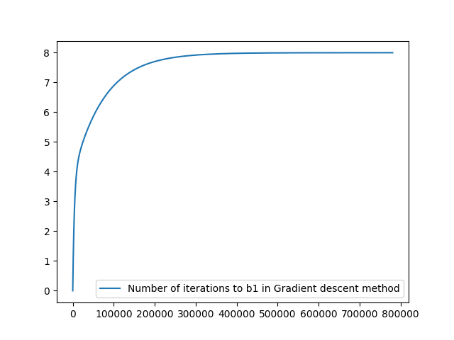

# Part 1: Comparing the np.polyfit function and Method of Least Squares

The difference for generated data is near ∆k ~ less than 1e-15

    
    

# Part 2: Using method of gradient descent
3rd graph shows dependancy of learning rate to the accuracy

    
    
    

